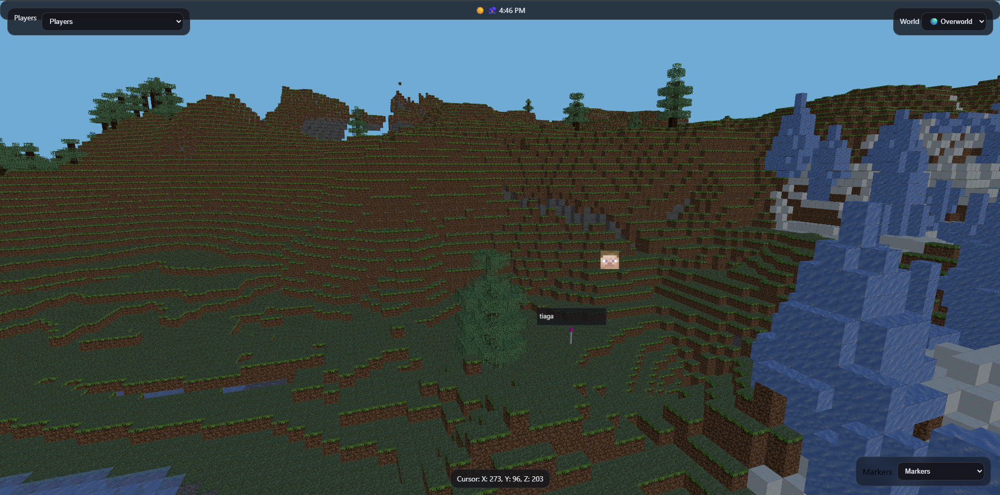

# Voxmap

*Overworld 3D render with dynamic lighting and foliage tint.*
Voxmap is a high-performance 3D web map renderer for Paper/Spigot
servers that visualizes your Minecraft worlds directly in the browser
using real voxel geometry.\
Unlike traditional 2D map renderers, Voxmap renders actual exposed block
faces into a fully navigable 3D scene powered by Three.js.

------------------------------------------------------------------------

## Features

-   🔷 Real 3D voxel rendering (exposed-face meshing)
-   🌍 Multi-world support (Overworld, Nether, End, custom worlds)
-   🧱 Live block updates via dirty-chunk invalidation
-   🗺️ 3D marker system (in-game commands)
-   👥 Online player tracking with head avatars
-   ☀️ Dynamic sky system (sun, moon, lighting, fog)
-   🌧️ Weather-aware lighting adjustments
-   🎨 Resource pack texture support (custom texture atlas generation)
-   💡 Torch & lantern light emitters (point lights)
-   🎮 WASD + Space + Shift movement
-   🔄 Optimized chunk streaming + throttled re-rendering
-   ⚙️ Fully configurable web server and UI elements

------------------------------------------------------------------------

## How Voxmap Works

### 1. Chunk Snapshot Rendering

Voxmap uses Paper's `ChunkSnapshot` API to read loaded chunk data
directly from memory.

For each chunk: - The `ExposedFaceMesher` scans blocks - Faces touching
air or non-occluding blocks are rendered - Internal faces are culled
(Minecraft-style face culling) - Vertex colors are applied for
biome-style tinting - UVs are mapped from a generated texture atlas -
Light emitters (torches, lanterns, glowstone) are detected

The result is converted to JSON and streamed to the web UI.

------------------------------------------------------------------------

### 2. Dirty Chunk System (Live Updates)

To avoid requiring restarts:

-   Block place/break events mark chunks as **dirty**
-   Next time `/api/chunk` is requested, the mesh is rebuilt
-   Only changed chunks are regenerated
-   Unloaded chunks are evicted from cache

This ensures performance and live updates without constant remeshing.

------------------------------------------------------------------------

### 3. Web Rendering Pipeline

The web UI uses:

-   Three.js (module build)
-   MeshStandardMaterial
-   Vertex color tinting
-   Dynamic sky + fog
-   Directional sun/moon lighting
-   Point lights for torches
-   Chunk streaming throttled when camera is moving

Chunks are only requested when: - The camera is still - 10 seconds have
elapsed - A chunk is not already loaded - A chunk was marked dirty

------------------------------------------------------------------------

## Installation

1.  Build the plugin with Gradle: gradlew clean build

2.  Place the generated JAR into your server's `plugins` folder.

3.  Start the server.

4.  Visit: http://127.0.0.1:PORT

Default port is defined in `config.yml`.

------------------------------------------------------------------------

## Configuration

### config.yml

Setting              Description
  -------------------- --------------------------------------
host                 Web server bind address
port                 Web server port
showClock            Show world time
showWeather          Show weather indicator
showDayNight         Show sun/moon emoji
texturepack          "default" or name of pack folder/zip
viewDistanceChunks   Chunk radius for rendering

------------------------------------------------------------------------

### worlds.yml

Auto-generated at startup.

Allows: - Changing display name - Setting icon (emoji) -
Enabling/disabling worlds

Example:

world: displayName: Overworld icon: 🌍 enabled: true

------------------------------------------------------------------------

## Adding a Custom Resource Pack

1.  Place your pack inside:

plugins/Voxmap/texturepacks/

You may use: - A folder containing assets/minecraft/... - A .zip
resource pack

2.  Edit config.yml:

texturepack: mypack.zip

3.  Restart the server.

Voxmap will: - Parse block textures - Build a texture atlas - Assign UV
mappings per block face

### Notes About Animated Textures

Animated textures (like water) use their first frame.\
Full animated atlas support is not yet implemented.

------------------------------------------------------------------------

## Marker System

In-game command:

/vmap marker add `<name>`{=html} `<label>`{=html}

Markers: - Save to markers.yml - Render as 3D pins - Appear in UI
dropdown - Teleport camera on selection

------------------------------------------------------------------------

## Player Tracking

-   Online players are listed in the UI
-   Avatars fetched from: https://mc-heads.net/avatar/`<uuid>`{=html}

Selecting a player: - Switches world if needed - Moves camera to their
position - Forces chunk load around them

------------------------------------------------------------------------

## Controls

Key                  Action
  -------------------- -------------------
Right Click + Drag   Rotate
Left Click + Drag    Pan
Scroll               Zoom
W / A / S / D        Move horizontally
Space                Move up
Shift                Move down

------------------------------------------------------------------------

## Performance Notes

-   Chunk rendering is throttled
-   Max inflight chunk requests capped
-   Chunk meshes cached server-side
-   Dirty chunks rebuilt only when needed
-   Light emitters capped per chunk

If FPS drops: - Lower viewDistanceChunks - Reduce MAX_INFLIGHT in
app.js - Reduce torch light count

------------------------------------------------------------------------

## Future Improvements

-   Region file (.mca) parsing for offline rendering
-   Animated texture atlas support
-   Biome color blending
-   LOD (level of detail) system
-   Frustum-based chunk culling
-   WebSocket live updates

------------------------------------------------------------------------

## Troubleshooting

### Blank UI

-   Ensure correct host (127.0.0.1, not 0.0.0.0)
-   Check browser console for module errors

### No Textures

-   Verify texturepack path
-   Ensure pack has assets/minecraft/textures/block/

### Chunk Not Updating

-   Ensure block events are firing
-   Confirm dirty system wired properly

------------------------------------------------------------------------

## Credits

Developed by Newt_00
Built using: - Paper API - Three.js - mc-heads.net API

------------------------------------------------------------------------

Voxmap is designed to provide a true voxel-accurate 3D representation of
your Minecraft world while remaining performant and extensible.
